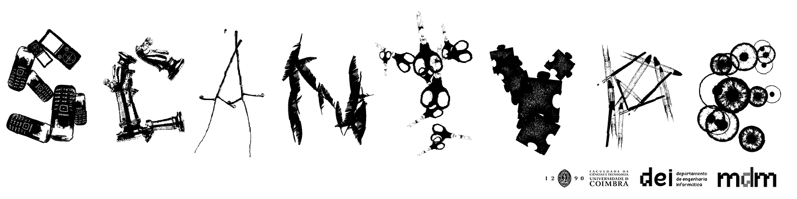
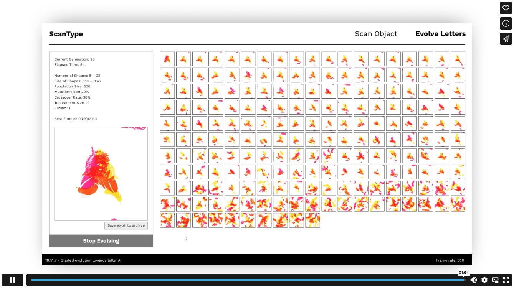
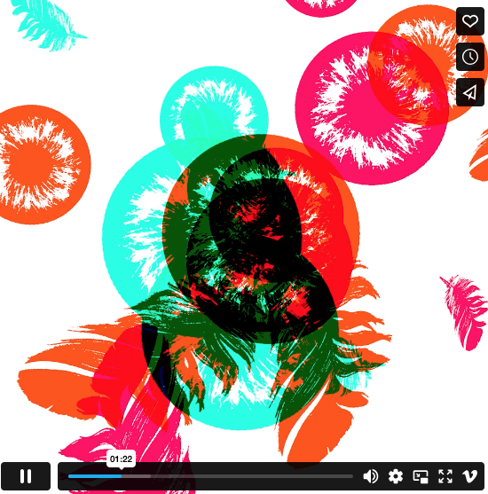
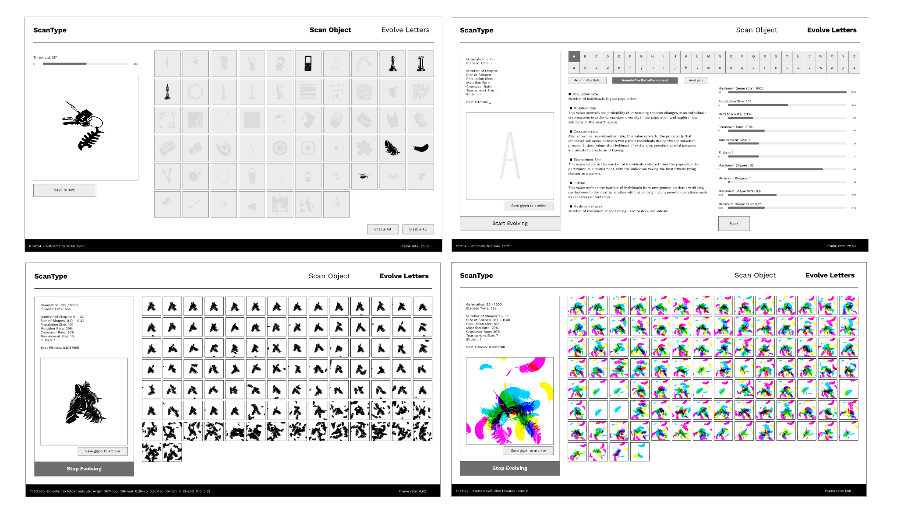
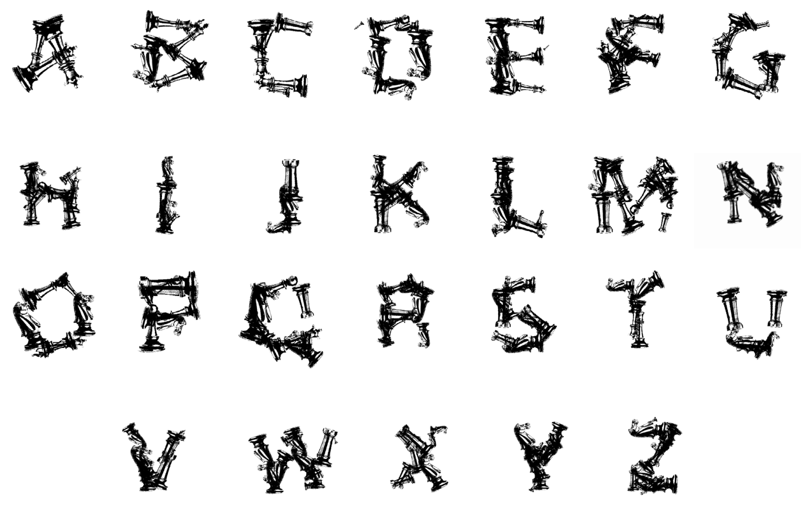
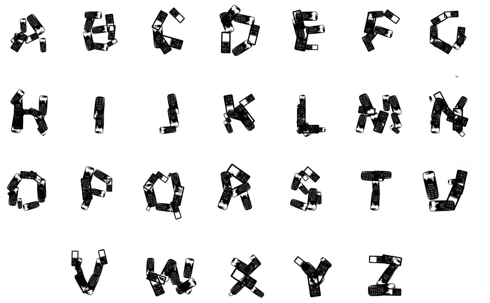
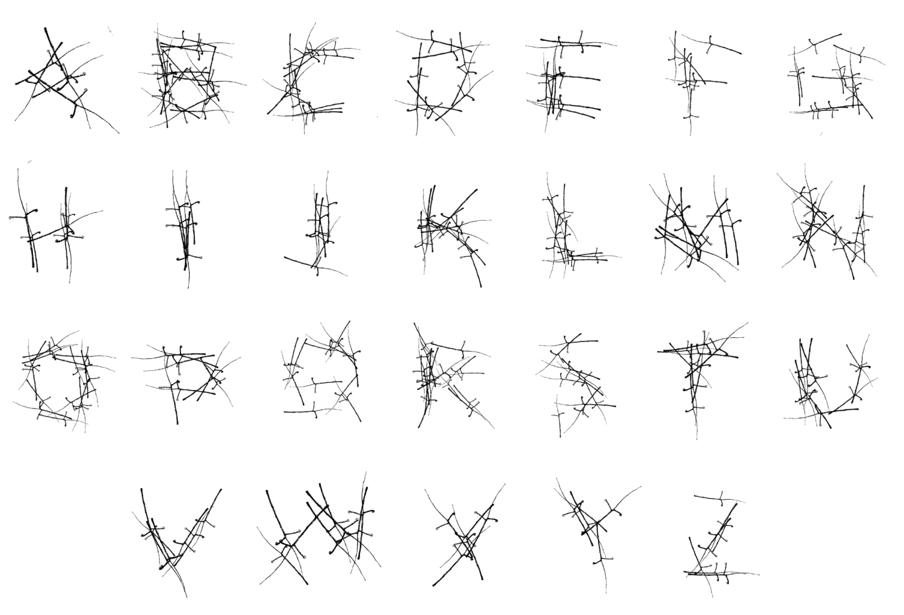
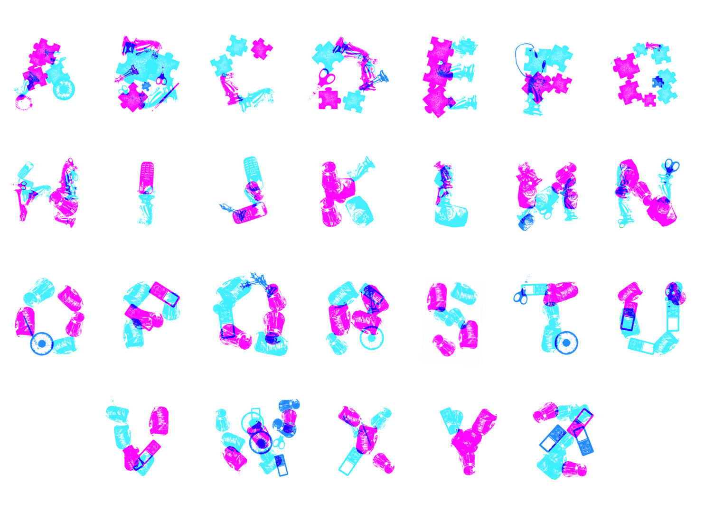

<a name="readme-top"></a>



Generative type design tool that implements a genetic algorithm to evolve letters composed of a set of images.</br></br>
The system allows users to capture images and select from a library the ones that will be used as input images to draw the individuals generated by the genetic algorithm.
Each individual is composed of a set of images that function as modular components, which are superimposed to construct the glyphs.
Users have control over key parameters of the genetic algorithm, including population size, crossover and mutation rates, tournament size, and elitism.
Additionally, users can define the range of the images' sizes and the range of the number of images that compose each individual.

# Watch the videos
### Documental Video
[]([https://vimeo.com/787131355](https://vimeo.com/836191932))


### Compilation of outputs

[]([https://vimeo.com/787131355](https://vimeo.com/836191932))
</br> One output per second.

# User Interface


# Structure of code
We implemented the application using [Processing](https://processing.org/examples/) and the Processing [Capture library](https://processing.org/reference/libraries/video/Capture.html).</br>

The sketch is structured in the following files:

**sketch**</br>
This file is responsible for the setup of the file, storing key variables and functions as well as updating and showing the different components of the program. The setup stage consists in initializing the capture, loading fonts and images and finally it instantiating the four main components needed in the program: scanScreen, evolutionScreen, header and console.

**header**</br>
Class for the header of the app. It allows the switch between scan and evolution tabs.

**console**</br>
The console consists of a black rectangle that displays messages on its left and right sides. The left message works as feedback for the user, reassuring them of events such as when a new evolution is started or an image is exported. On the right side we can see the current frame rate of the program, facilitating the assessment of the performance.
scanScreen
Class that lets the user import custom objects using the camera, as well as selecting which ones will be used in the evolution.

**evolutionScreen**</br>
Class where the user can evolve and export results.

**algorithmWindow**</br>
The algorithm window is used as a child of evolutionScreen as a way to better organize the code. It consists of a description of the different parameters available in the evolution as well as sliders and buttons to change those variables.

**individual**</br>
Class that contains a genotype and is capable of rendering phenotypes.

**population**</br>
Class that contains and manages a list of individuals.

**evaluator**</br>
Class that assigns fitness values to individuals throughout the evaluation, by comparing them to the chosen reference image.

**button**</br>
Class to draw the buttons. It has three different types: text, boxed or not, and image.
Each text button has its information horizontally and vertically aligned, can have a selected, enabled and disabled state, and is initialized with the following inputs: 

```
String _buttonText, boolean _boxed, float _x, float _y, float _w, float _h,
float _fontSize, int _alignHorizontal, int _alignVertical
```

 Image buttons on the other hand have the following inputs:
```
PImage _buttonImage, float _x, float _y, float _w, float _h
```

**slider**</br>
Class to draw the sliders.
Each slider has a hovered/not hovered state, and is initialized with the following inputs:
```
boolean _isPercentage, String _legend, float _minVal, float _maxVal,
float _w, float _h, float _initialVal, boolean _isInt
```
</br>


# Output Examples</br>

</br>

</br>

</br>

</br>
</br>


# Acknowledgements
This project was developed by Alexandra Oliveira and João Santos as part of the course [Computational Creativity for Design](https://apps.uc.pt/courses/EN/unit/90567/21924/2023-2024?common_core=true&type=ram&id=468)
from the Master program in [Design and Multimedia](https://www.dei.uc.pt/mdm/?en) at the University of Coimbra under the guidance and supervision of Professors 
[Pedro Martins](https://cdv.dei.uc.pt/authors/pedro-martins/),
[Hugo Oliveira](https://www.cisuc.uc.pt/en/people/hugo-oliveira-1),
[João M. Cunha](https://cdv.dei.uc.pt/authors/joao-cunha/),
[Penousal Machado](https://cdv.dei.uc.pt/authors/penousal-machado/),
[Sérgio Rebelo](https://cdv.dei.uc.pt/authors/sergio-rebelo/), and
[Tiago Martins](http://cdv.dei.uc.pt/people/tiago-martins/) 
{pjmm, machado, hroliv, jmacunha, srebelo, tiagofm}@dei.uc.pt.

We want to give a special thanks to [Sérgio Rebelo](https://cdv.dei.uc.pt/authors/sergio-rebelo/) and [Tiago Martins](https://cdv.dei.uc.pt/authors/tiago-martins/) for providing us the evolutionary algorithm code available at [Evolving Harmonographs tutorial](https://github.com/tiagofmartins/evolving-harmonographs), a tutorial that covers the implementation and application of a Genetic Algorithm, and which served as the starting point for the implementation of ScanType.

June 2023

<p align="right">(<a href="#readme-top">back to top</a>)</p>
